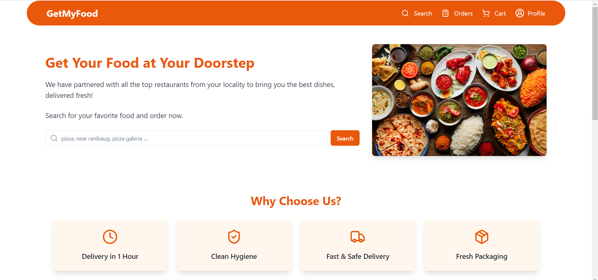
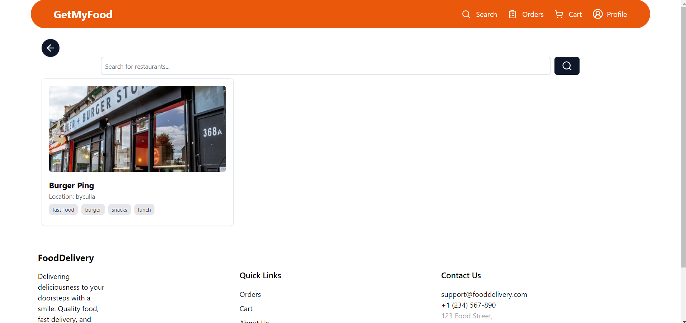
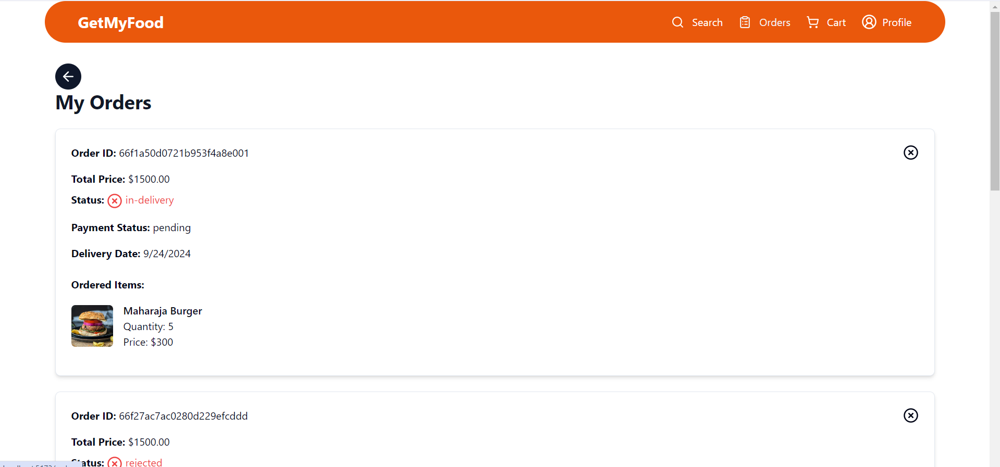
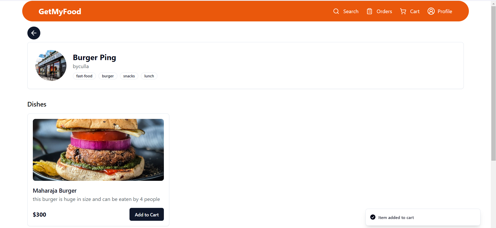
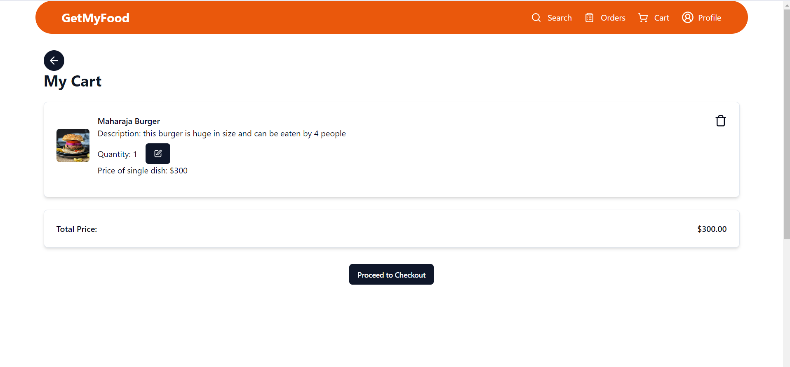
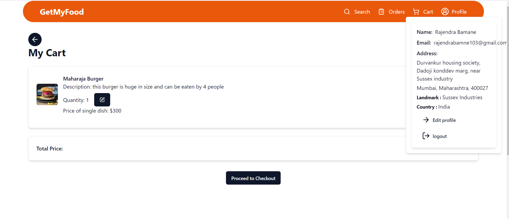
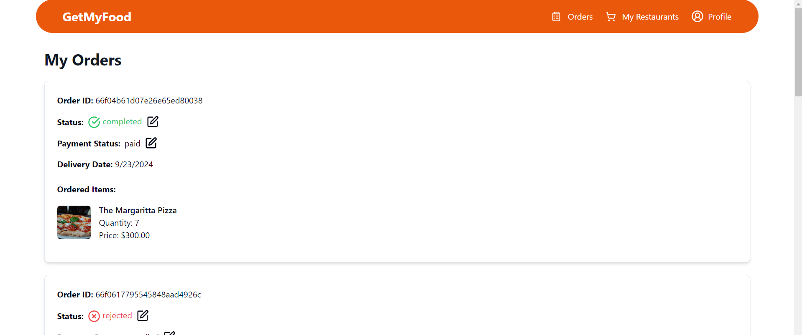
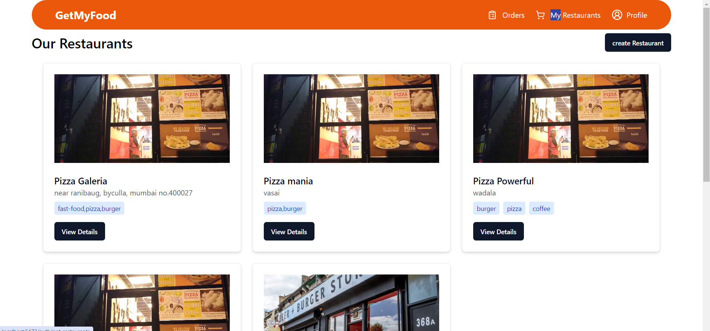
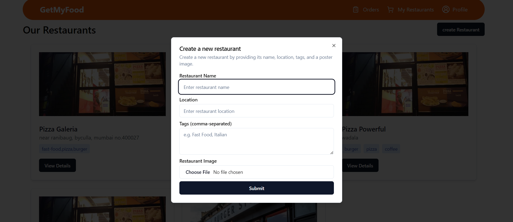
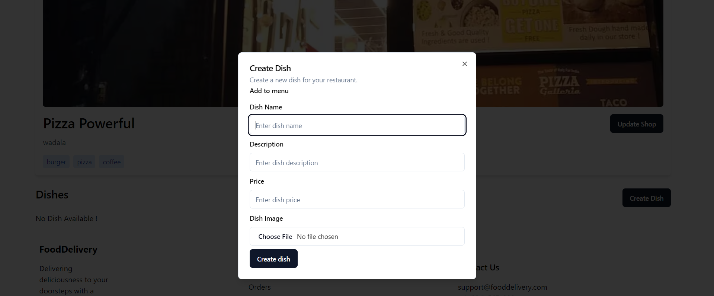

  <h1 align="center">GetMyFood 🍽️</h1>

  

    <strong>Buy your favorite food dishes from top restaurants, and for restaurant owners, manage your restaurant and
      orders with ease!</strong>
  

  

  <h2>🚀 About the Project</h2>

  
<strong>GetMyFood</strong> is a MERN stack-based application that allows users to browse through various
    restaurants, add food items to the cart, and place orders. It also empowers restaurant owners to:

  <ul>
    <li>Create their restaurant profile.</li>
    <li>Add and manage food dishes (menu).</li>
    <li>Manage customer orders.</li>
  </ul>

  

  <h2>🛠️ Technologies Used</h2>
  <ul>
    <li><strong>Frontend:</strong> React, Shadcn UI, Zustand (State Management)</li>
    <li><strong>Backend:</strong> Node.js, Express.js, MongoDB, Nodemailer for transactional emails</li>
    <li><strong>Styling:</strong> Tailwind CSS</li>
    <li><strong>Testing:</strong> Postman for backend API testing and manual testing for the frontend.</li>
  </ul>

  

  <h2>🎯 Features</h2>
  
<strong>Users:</strong>

  <ul>
    <li>Browse restaurants and food menus.</li>
    <li>Add dishes to cart and place orders.</li>
  </ul>

  
<strong>Restaurant Owners:</strong>

  <ul>
    <li>Create and manage restaurant profiles.</li>
    <li>Add and edit food items in the menu.</li>
    <li>Manage customer orders in real-time.</li>
  </ul>

  

  <h2>📧 Email Notifications</h2>
  
The application uses <strong>Nodemailer</strong> for email notifications, allowing users to receive confirmations
    and updates about their orders.

  

    <h2>📱 User Interfaces : </h2>
    <h3>Users Pages : </h3>
    
    
    
    
    
    
    <h3>Admin Pages : </h3>
    
    
    
    
  

  <h2>📦 Installation & Setup</h2>
  <ol>
    <li><strong>Clone the Repository:</strong>
      <pre><code>git clone https://github.com/yourusername/getmyfood.git</code></pre>
    </li>

    <li><strong>Install Dependencies:</strong>
      <pre><code>cd getmyfood npm install</code></pre>
    </li>

    <li><strong>Set up Environment Variables:</strong> Create a <code>.env</code> file in the root directory and add the required environment variables:
      <pre><code>MONGO_URI=your-mongo-db-uri JWT_SECRET=your-jwt-secret EMAIL_USER=your-email-user EMAIL_PASS=your-email-password</code></pre>
    </li>

    <li><strong>Run the Application:</strong>
      <pre><code>npm start</code></pre>
    </li>
  </ol>

  

  <h2>🧪 Testing</h2>
  
<strong>Backend:</strong> Tested using Postman to ensure API routes are functioning correctly.

  
<strong>Frontend:</strong> Manually tested by interacting with the UI to ensure a smooth user experience.

  

  <h2>🤝 Contributing</h2>
  
Feel free to submit issues or pull requests if you would like to contribute to <strong>GetMyFood</strong>.

  

  <h2>🌐 Live Demo</h2>
  
Check out the live demo of the application <a href="#">here</a>.

